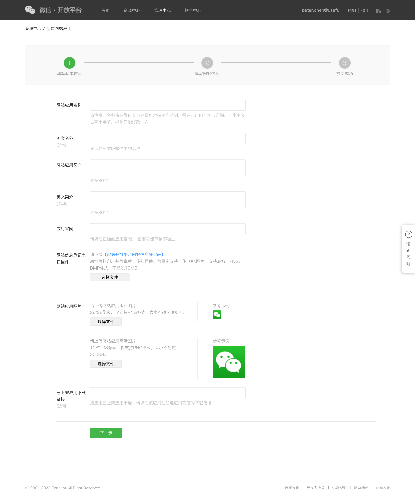
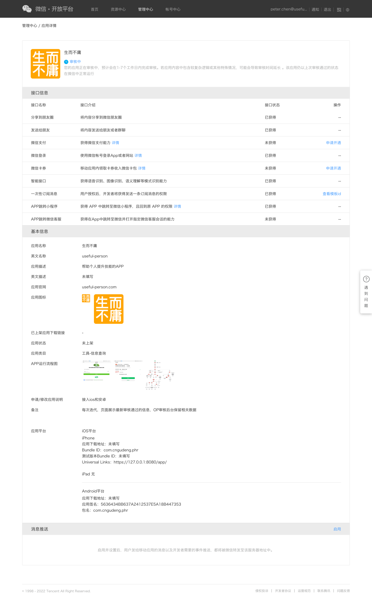

# 安卓证书

## 生成证书
android.keystore是本地使用jdk8生成的证书。

生成支持md5的安卓证书，因为从jdk1.8.0_202这个版本后，不再支持md5了，所以请下载安装`jdk1.8.0_202`版本后执行下面命令;

```shell
(base) chenbitao@chenbitaodeMacBook-Pro daw-phr-weapp % keytool -genkey -alias Android -keyalg RSA -keysize 2048 -validity 36500 -keystore Andorid.keystore
输入密钥库口令:
再次输入新口令:
您的名字与姓氏是什么?
  [Unknown]:  cngudeng
您的组织单位名称是什么?
  [Unknown]:  cngudeng
您的组织名称是什么?
  [Unknown]:  cngudeng
您所在的城市或区域名称是什么?
  [Unknown]:  shenzhen
您所在的省/市/自治区名称是什么?
  [Unknown]:  guangdong
该单位的双字母国家/地区代码是什么?
  [Unknown]:  cn
CN=cngudeng, OU=cngudeng, O=cngudeng, L=shenzhen, ST=guangdong, C=cn是否正确?
  [否]:  是

输入 <Android> 的密钥口令
	(如果和密钥库口令相同, 按回车):
再次输入新口令:

Warning:
JKS 密钥库使用专用格式。建议使用 "keytool -importkeystore -srckeystore Andorid.keystore -destkeystore Andorid.keystore -deststoretype pkcs12" 迁移到行业标准格式 PKCS12。
```

查看指纹，获得md5码，并将中间的冒号都去除，得到微信开放平台需要使用的MD5`5636434BB637A2412537E5A18B447353`

```shell
(base) chenbitao@chenbitaodeMacBook-Pro daw-phr-weapp % keytool -list -v -keystore ./cert/Android.keystore
输入密钥库口令:
密钥库类型: jks
密钥库提供方: SUN

您的密钥库包含 1 个条目

别名: android
创建日期: 2022-10-12
条目类型: PrivateKeyEntry
证书链长度: 1
证书[1]:
所有者: CN=cngudeng, OU=cngudeng, O=cngudeng, L=shenzhen, ST=guangdong, C=cn
发布者: CN=cngudeng, OU=cngudeng, O=cngudeng, L=shenzhen, ST=guangdong, C=cn
序列号: 5c9aa6ad
有效期为 Wed Oct 12 12:17:34 CST 2022 至 Fri Sep 18 12:17:34 CST 2122
证书指纹:
	 MD5:  FE:E5:7E:5D:7F:73:27:71:76:6E:C0:C9:0E:C6:28:DB
	 SHA1: 77:95:04:B5:26:EB:76:7E:ED:62:C8:26:66:60:00:28:BA:12:80:98
	 SHA256: A2:AA:48:A4:23:96:BC:89:FA:9A:29:29:59:8D:D1:CC:42:1B:FE:2A:6F:0A:FC:08:13:DC:B0:A5:9D:05:2F:A6
签名算法名称: SHA256withRSA
主体公共密钥算法: 2048 位 RSA 密钥
版本: 3

扩展:

#1: ObjectId: 2.5.29.14 Criticality=false
SubjectKeyIdentifier [
KeyIdentifier [
0000: 5E 52 6B 02 6E 81 56 E1   47 0D F6 05 5B C8 1A 3E  ^Rk.n.V.G...[..>
0010: 7C 42 E2 6B                                        .B.k
]
]


*******************************************
*******************************************


Warning:
JKS 密钥库使用专用格式。建议使用 "keytool -importkeystore -srckeystore ./cert/Android.keystore -destkeystore ./cert/Android.keystore -deststoretype pkcs12" 迁移到行业标准格式 PKCS12。
```

## 使用云打包
打开hBuilderX，选中项目，点击发行-> 原生App云打包


```shell
[HBuilder] 16:05:39.626 <br>1. 你今天已打包很多次了，让云打包服务器休息休息吧，你可以明天再来。<br>2. 若需调试推送等三方SDK，可点击菜单“运行” —>“运行到手机或模拟器”—>“制作自定义基座”，<br>无需频繁提交云端打包。<br>3. 我们为正常进行打包的开发者提供了足够的免费打包次数，请合理安排资源，<br>珍惜打包服务器资源，减少他人排队等待。当然，你可以考虑购买额外的打包次数，请使用当前账号登录<br> https://dev.dcloud.net.cn ，选择“App云打包增值服务”->“打包个数充值”进行购买。<br>
[HBuilder] 16:06:11.641 项目 'daw-phr-weapp' 开始编译...
[HBuilder] 16:06:12.242 3.5.3
[HBuilder] 16:06:12.330 正在编译中...
[HBuilder] 16:06:12.877 当前生效env文件 .env.production
[HBuilder] 16:06:12.882 Pure.jpg
[HBuilder] 16:06:12.885 logo/logo.png
[HBuilder] 16:06:12.885 uni-h5-hosting-qr.png
[HBuilder] 16:06:14.211 开始上传阿里云OSS存储
[HBuilder] 16:06:14.217 开始上传阿里云OSS存储
[HBuilder] 16:06:14.341 src/assets/uni-h5-hosting-qr.png 上传成功!
[HBuilder] 16:06:14.341 http://uniapp-assets-store.oss-cn-shenzhen.aliyuncs.com/uni-h5-hosting-qr.png
[HBuilder] 16:06:20.546 src/assets/logo/logo.png 上传成功!
[HBuilder] 16:06:20.550 http://uniapp-assets-store.oss-cn-shenzhen.aliyuncs.com/logo/logo.png
[HBuilder] 16:06:21.101 src/assets/Pure.jpg 上传成功!
[HBuilder] 16:06:21.105 http://uniapp-assets-store.oss-cn-shenzhen.aliyuncs.com/Pure.jpg
[HBuilder] 16:09:09.312 WARNING: Module not found: Error: Can't resolve '@/uni_modules/z-paging' in '/Users/chenbitao/Developer/coding/daw-phr-weapp/node_modules/z-paging/components/z-paging/js'
[HBuilder] 16:09:09.314 上传阿里云OSS存储完成!
[HBuilder] 16:09:09.315 项目 'daw-phr-weapp' 编译成功。
[HBuilder] 16:09:09.316 WARNING: Module not found: Error: Can't resolve '@/uni_modules/z-paging' in '/Users/chenbitao/Developer/coding/daw-phr-weapp/node_modules/z-paging/components/z-paging/js'
[HBuilder] 16:09:09.316 上传阿里云OSS存储完成!
[广告] 16:09:11.490 DCloud 2022新春招聘开启，欢迎前端、Android、C++/QT来投简历! 详情点击

[HBuilder] 16:09:11.514 打包成功后会自动返回下载链接。
[HBuilder] 16:09:11.514 打包过程查询请点菜单发行-查看云打包状态。
[HBuilder] 16:09:11.514 周五傍晚等高峰期打包排队较长，请耐心等待。
[HBuilder] 16:09:11.514 如果是为了三方SDK调试，请使用自定义调试基座（菜单运行-手机或模拟器-制作自定义调试基座），不要反复打包。
[HBuilder] 16:09:11.514 项目 daw-phr-weapp [__UNI__5D32F48]已成功提交到云端，正在获取打包状态...

[HBuilder] 16:09:15.119 项目 daw-phr-weapp [__UNI__5D32F48]的打包状态：
[HBuilder] 16:09:15.120 时间: 2022-10-12 16:09:11    类型: Android自有证书    队列中    
[HBuilder] 16:09:15.120 目前云打包排队人数较多，当前打包任务位于队列第 20位，预计 7 分钟内进入打包状态。

[HBuilder] 16:09:15.529 项目 daw-phr-weapp [__UNI__5D32F48]的打包状态：
[HBuilder] 16:09:15.529 时间: 2022-10-12 16:09:11    类型: Android自有证书    队列中    
[HBuilder] 16:09:15.529 目前云打包排队人数较多，当前打包任务位于队列第 19位，预计 6 分钟内进入打包状态。

[HBuilder] 16:10:12.018 项目 daw-phr-weapp [__UNI__5D32F48]的打包状态：
[HBuilder] 16:10:12.018 时间: 2022-10-12 16:09:11    类型: Android自有证书    队列中    
[HBuilder] 16:10:12.019 目前云打包排队人数较多，当前打包任务位于队列第 17位，预计 5 分钟内进入打包状态。

[HBuilder] 16:11:09.527 项目 daw-phr-weapp [__UNI__5D32F48]的打包状态：
[HBuilder] 16:11:09.527 时间: 2022-10-12 16:09:11    类型: Android自有证书    队列中    
[HBuilder] 16:11:09.527 目前云打包排队人数较多，当前打包任务位于队列第 15位，预计 5 分钟内进入打包状态。

[HBuilder] 16:12:09.040 项目 daw-phr-weapp [__UNI__5D32F48]的打包状态：
[HBuilder] 16:12:09.041 时间: 2022-10-12 16:09:11    类型: Android自有证书    队列中    
[HBuilder] 16:12:09.041 目前云打包排队人数较多，当前打包任务位于队列第 10位，预计 4 分钟内进入打包状态。

[HBuilder] 16:13:08.557 项目 daw-phr-weapp [__UNI__5D32F48]的打包状态：
[HBuilder] 16:13:08.558 时间: 2022-10-12 16:09:11    类型: Android自有证书    队列中    
[HBuilder] 16:13:08.558 目前云打包排队人数较多，当前打包任务位于队列第 6位，预计 2 分钟内进入打包状态。

[HBuilder] 16:14:04.129 项目 daw-phr-weapp [__UNI__5D32F48]的打包状态：
[HBuilder] 16:14:04.130 时间: 2022-10-12 16:09:11    类型: Android自有证书    队列中    
[HBuilder] 16:14:04.130 目前云打包排队人数较多，当前打包任务位于队列第 5位，预计 2 分钟内进入打包状态。

[HBuilder] 16:15:03.518 项目 daw-phr-weapp [__UNI__5D32F48]的打包状态：
[HBuilder] 16:15:03.518 时间: 2022-10-12 16:09:11    类型: Android自有证书    队列中    
[HBuilder] 16:15:03.519 目前云打包排队人数较多，当前打包任务位于队列第 3位，预计 1 分钟内进入打包状态。

[HBuilder] 16:16:02.041 项目 daw-phr-weapp [__UNI__5D32F48]的打包状态：
[HBuilder] 16:16:02.041 时间: 2022-10-12 16:09:11    类型: Android自有证书    正在云端打包    
[HBuilder] 16:16:02.042 预计2-5分钟完成打包。如项目使用了App原生插件，打包时间可能会较长，请耐心等待。

[HBuilder] 16:16:58.628 项目 daw-phr-weapp [__UNI__5D32F48]的打包状态：
[HBuilder] 16:16:58.629 时间: 2022-10-12 16:09:11    类型: Android自有证书    正在云端打包    
[HBuilder] 16:16:58.629 预计2-5分钟完成打包。如项目使用了App原生插件，打包时间可能会较长，请耐心等待。

[HBuilder] 16:18:11.810 项目 daw-phr-weapp [__UNI__5D32F48]的打包状态：
[HBuilder] 16:18:11.810 时间: 2022-10-12 16:09:11    类型: Android自有证书    正在本地生成安装包(请勿关闭HBuilderX)    

[HBuilder] 16:18:27.165 项目 daw-phr-weapp [__UNI__5D32F48]的打包状态：
[HBuilder] 16:18:27.166 时间: 2022-10-12 16:09:11    类型: Android自有证书    打包成功    安装包位置：/Users/chenbitao/Developer/coding/daw-phr-weapp/dist/release/apk/__UNI__5D32F48__20221012160911.apk	[打开所在目录]    [一键上传到uniCloud（免费cdn、长期稳定）]
[HBuilder] 16:18:27.167 HBuilderX已支持App cli自动化打包, 详情参考: https://hx.dcloud.net.cn/cli/pack [不再提示]
```

将打包后的文件下载到安卓手机上，并安装[Gen_Signature_Android](https://res.wx.qq.com/wxdoc/dist/assets/media/Gen_Signature_Android.e481f889.zip)


打开GenSignature,输入包名，点击Get Signature，成功生成签名，复制用于后面的配置微信开放平台。


## 配置微信开放平台
打开微信开放平台https://open.weixin.qq.com/，点击管理中心
### 新建移动应用
切换到网站应用，点击创建网站应用，填写必要的信息即可提交。



### 新建app应用
切换到移动应用，点击创建移动应用，填写必要的信息即可提交，应用名称和主体、应用流程图需要和主体一致，其中Bundle Id和包名分别在ios和安卓中来标志app唯一身份，要和打包时的包名一致。提交审核即可，如果拒绝，重新补充资料等待审核通过。



## 打包自定义调试基座

```shell
[HBuilder] 15:33:17.962 项目 'daw-phr-weapp' 开始编译...
[HBuilder] 15:33:18.563 3.5.3
[HBuilder] 15:33:18.665 正在编译中...
[HBuilder] 15:33:19.222 当前生效env文件 .env.production
[HBuilder] 15:33:19.225 Pure.jpg
[HBuilder] 15:33:19.226 logo/logo.png
[HBuilder] 15:33:19.228 uni-h5-hosting-qr.png
[HBuilder] 15:33:20.552 开始上传阿里云OSS存储
[HBuilder] 15:33:20.557 开始上传阿里云OSS存储
[HBuilder] 15:33:24.824 src/assets/uni-h5-hosting-qr.png 上传成功!
[HBuilder] 15:33:24.828 http://uniapp-assets-store.oss-cn-shenzhen.aliyuncs.com/uni-h5-hosting-qr.png
[HBuilder] 15:33:24.830 src/assets/logo/logo.png 上传成功!
[HBuilder] 15:33:24.832 http://uniapp-assets-store.oss-cn-shenzhen.aliyuncs.com/logo/logo.png
[HBuilder] 15:33:27.657 src/assets/Pure.jpg 上传成功!
[HBuilder] 15:33:27.657 http://uniapp-assets-store.oss-cn-shenzhen.aliyuncs.com/Pure.jpg
[HBuilder] 15:36:08.872 WARNING: Module not found: Error: Can't resolve '@/uni_modules/z-paging' in '/Users/chenbitao/Developer/coding/daw-phr-weapp/node_modules/z-paging/components/z-paging/js'
[HBuilder] 15:36:08.878 上传阿里云OSS存储完成!
[HBuilder] 15:36:08.881 项目 'daw-phr-weapp' 编译成功。
[HBuilder] 15:36:08.892 WARNING: Module not found: Error: Can't resolve '@/uni_modules/z-paging' in '/Users/chenbitao/Developer/coding/daw-phr-weapp/node_modules/z-paging/components/z-paging/js'
[HBuilder] 15:36:08.892 上传阿里云OSS存储完成!
[广告] 15:36:11.115 DCloud 2022新春招聘开启，欢迎前端、Android、C++/QT来投简历! 详情点击

[HBuilder] 15:36:11.182 打包成功后会自动返回下载链接。
[HBuilder] 15:36:11.182 打包过程查询请点菜单发行-查看云打包状态。
[HBuilder] 15:36:11.182 周五傍晚等高峰期打包排队较长，请耐心等待。
[HBuilder] 15:36:11.182 项目 daw-phr-weapp [__UNI__5D32F48]已成功提交到云端，正在获取打包状态...

[HBuilder] 15:36:14.591 项目 daw-phr-weapp [__UNI__5D32F48]的打包状态：
[HBuilder] 15:36:14.591 时间: 2022-10-12 15:36:11    类型: Android自有证书    队列中    
[HBuilder] 15:36:14.592 目前云打包排队人数较多，当前打包任务位于队列第 25位，预计 8 分钟内进入打包状态。

[HBuilder] 15:36:14.956 项目 daw-phr-weapp [__UNI__5D32F48]的打包状态：
[HBuilder] 15:36:14.956 时间: 2022-10-12 15:36:11    类型: Android自有证书    队列中    
[HBuilder] 15:36:14.956 目前云打包排队人数较多，当前打包任务位于队列第 25位，预计 8 分钟内进入打包状态。

[HBuilder] 15:37:11.393 项目 daw-phr-weapp [__UNI__5D32F48]的打包状态：
[HBuilder] 15:37:11.393 时间: 2022-10-12 15:36:11    类型: Android自有证书    队列中    
[HBuilder] 15:37:11.393 目前云打包排队人数较多，当前打包任务位于队列第 23位，预计 8 分钟内进入打包状态。

[HBuilder] 15:38:09.882 项目 daw-phr-weapp [__UNI__5D32F48]的打包状态：
[HBuilder] 15:38:09.882 时间: 2022-10-12 15:36:11    类型: Android自有证书    队列中    
[HBuilder] 15:38:09.883 目前云打包排队人数较多，当前打包任务位于队列第 18位，预计 7 分钟内进入打包状态。

[HBuilder] 15:39:06.351 项目 daw-phr-weapp [__UNI__5D32F48]的打包状态：
[HBuilder] 15:39:06.352 时间: 2022-10-12 15:36:11    类型: Android自有证书    队列中    
[HBuilder] 15:39:06.352 目前云打包排队人数较多，当前打包任务位于队列第 16位，预计 7 分钟内进入打包状态。

[HBuilder] 15:40:01.817 项目 daw-phr-weapp [__UNI__5D32F48]的打包状态：
[HBuilder] 15:40:01.817 时间: 2022-10-12 15:36:11    类型: Android自有证书    队列中    
[HBuilder] 15:40:01.817 目前云打包排队人数较多，当前打包任务位于队列第 10位，预计 4 分钟内进入打包状态。

[HBuilder] 15:40:59.293 项目 daw-phr-weapp [__UNI__5D32F48]的打包状态：
[HBuilder] 15:40:59.293 时间: 2022-10-12 15:36:11    类型: Android自有证书    队列中    
[HBuilder] 15:40:59.294 目前云打包排队人数较多，当前打包任务位于队列第 8位，预计 4 分钟内进入打包状态。

[HBuilder] 15:41:55.785 项目 daw-phr-weapp [__UNI__5D32F48]的打包状态：
[HBuilder] 15:41:55.785 时间: 2022-10-12 15:36:11    类型: Android自有证书    队列中    
[HBuilder] 15:41:55.785 目前云打包排队人数较多，当前打包任务位于队列第 7位，预计 3 分钟内进入打包状态。

[HBuilder] 15:42:51.218 项目 daw-phr-weapp [__UNI__5D32F48]的打包状态：
[HBuilder] 15:42:51.218 时间: 2022-10-12 15:36:11    类型: Android自有证书    队列中    
[HBuilder] 15:42:51.218 目前云打包排队人数较多，当前打包任务位于队列第 4位，预计 1 分钟内进入打包状态。

[HBuilder] 15:43:50.907 项目 daw-phr-weapp [__UNI__5D32F48]的打包状态：
[HBuilder] 15:43:50.907 时间: 2022-10-12 15:36:11    类型: Android自有证书    队列中    
[HBuilder] 15:43:50.907 目前云打包排队人数较多，当前打包任务位于队列第 2位，预计 1 分钟内进入打包状态。

[HBuilder] 15:44:50.424 项目 daw-phr-weapp [__UNI__5D32F48]的打包状态：
[HBuilder] 15:44:50.424 时间: 2022-10-12 15:36:11    类型: Android自有证书    正在云端打包    
[HBuilder] 15:44:50.424 预计2-5分钟完成打包。如项目使用了App原生插件，打包时间可能会较长，请耐心等待。

[HBuilder] 15:45:45.807 项目 daw-phr-weapp [__UNI__5D32F48]的打包状态：
[HBuilder] 15:45:45.807 时间: 2022-10-12 15:36:11    类型: Android自有证书    正在云端打包    
[HBuilder] 15:45:45.807 预计2-5分钟完成打包。如项目使用了App原生插件，打包时间可能会较长，请耐心等待。

[HBuilder] 15:46:55.449 项目 daw-phr-weapp [__UNI__5D32F48]打自定义调试基座包成功：
    路径为: /Users/chenbitao/Developer/coding/daw-phr-weapp/dist/debug/android_debug.apk
选择菜单“运行->运行到手机或模拟器->运行基座选择->自定义调试基座”后再次运行项目，即可通过自定义调试基座查看日志
注：自定义调试基座不可用于正式发布，其脱离HBuilderX无法更新应用资源
[HBuilder] 15:46:55.449 应用manifest不修改且未使用原生插件的情况下，非首次打包使用安心打包的速度更快且不占用云端打包次数。推荐下次使用安心打包功能。

```

